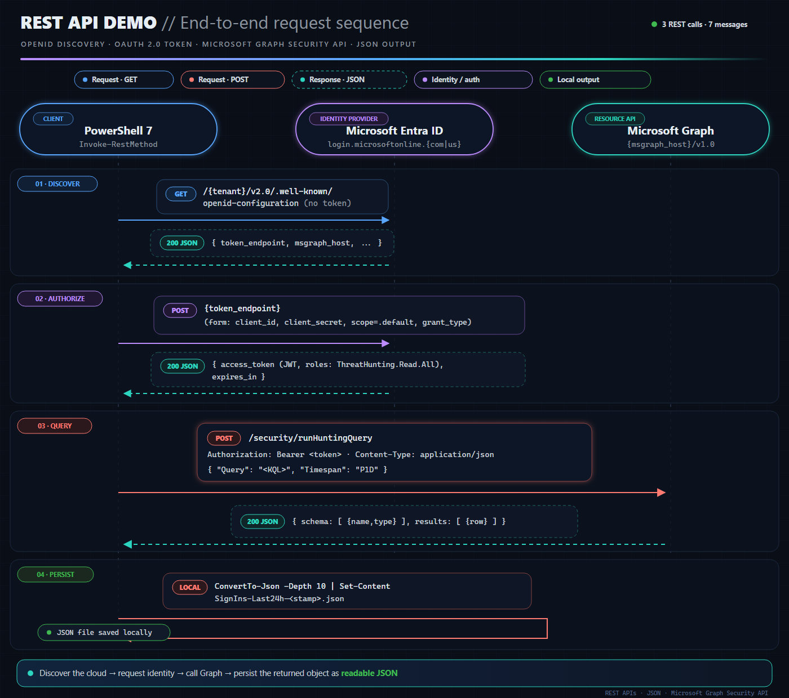
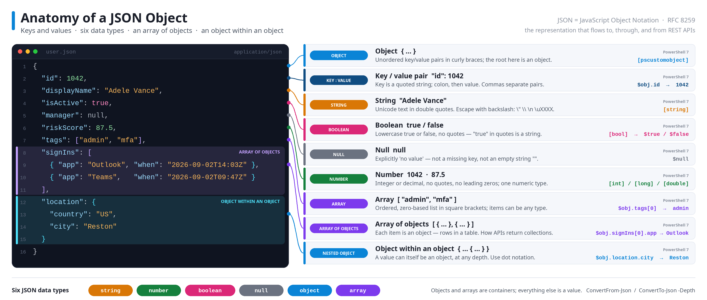

# REST APIs, JSON & the Microsoft Graph Security API

> A hands-on training kit for Cloud Solution Architects: a 20-slide deck, three interactive request-flow simulations, an "Anatomy of a JSON Object" diagram, and a live PowerShell 7 demo that runs a Microsoft Defender XDR advanced hunting query through the **Microsoft Graph Security API** (`POST /security/runHuntingQuery`) using `ThreatHunting.Read.All` with a client secret, a correlated training certificate, and delegated sign-in.


---

## What you will learn

- Why REST APIs are the bedrock of Cloud, GenAI, web applications and MCP — and what **REST** (REpresentational State Transfer), **API** and **JSON** actually stand for.
- The anatomy of a REST call: verb · URI · headers · body → status code · headers · body.
- The anatomy of JSON: objects, key/value pairs, the six data types, arrays of objects, objects within objects — and how each maps to PowerShell 7.
- How the Graph Security API exposes advanced hunting, what `ThreatHunting.Read.All` grants, and why **admin consent** exists, who can give it and how (portal, URL, prompt, or programmatically).
- How an OAuth 2.0 token flows from an app registration to a `200 OK`.
- `Invoke-RestMethod` switch by switch: `-Method`, `-Uri`, `-Authentication Bearer -Token`, `-ContentType`, `-Body`, `-StatusCodeVariable`, `-ResponseHeadersVariable`, `-SkipHttpErrorCheck`, `-MaximumRetryCount`.

## What is in this repository

| File | Purpose |
| --- | --- |
| [`REST-APIs-JSON-Graph-Security-API.html`](class_content/REST-APIs-JSON-Graph-Security-API.html) | The 20-slide deck. One self-contained HTML file (Microsoft dark Fluent style) — open in any browser, present with **F**, speaker notes with **N**. |
| [`Sim-App-Registration-Admin-Consent.html`](class_content/Sim-App-Registration-Admin-Consent.html) | 13-step simulation of creating the app registration, correlated training certificate, client secret, service principal, and programmatic admin consent through Microsoft Graph. |
| [`Sim-AppOnly-Client-Credentials.html`](class_content/Sim-AppOnly-Client-Credentials.html) | 12-step simulation of OpenID discovery, the OAuth 2.0 client-credentials token request, `runHuntingQuery`, error boundaries, and JSON output. |
| [`Sim-Delegated-Sign-In-Consent.html`](class_content/Sim-Delegated-Sign-In-Consent.html) | 13-step simulation of delegated Windows Web Account Manager sign-in, admin consent, the `scp` claim, and the Graph hunting call. |
| [`Identity_101.md`](extras/Identity_101.md) | Supplemental primer on app-only scopes, client secrets, certificates, managed identities, and Microsoft Graph application permissions. |
| [`Identity_102.md`](extras/Identity_102.md) | Deep dive into `principalId`, `resourceId`, and `appRoleId` for managed-identity app-role assignments. |
| [`Identity_103.md`](extras/Identity_103.md) | Guide to identifying an API resource URI, forming its `/.default` scope, and validating token audience and roles. |
| [`JSON-Anatomy-Diagram.svg`](images/JSON-Anatomy-Diagram.svg) · [`JSON-Anatomy-Diagram.png`](images/JSON-Anatomy-Diagram.png) | Stand-alone diagram of a JSON object: keys/values, string, number, boolean, null, array, array of objects, nested object, with PowerShell 7 equivalents. Also embedded on slide 8. |
| [`rest-api-demo-flow-neon.svg`](images/rest-api-demo-flow-neon.svg) · [`rest-api-demo-flow-neon.png`](images/rest-api-demo-flow-neon.png) | Dark-neon sequence diagram of the complete demo flow: endpoint discovery, OAuth token request, Graph hunting query, JSON response, and local persistence. |
| [`New-HuntingAppRegistration.ps1`](scripts/New-HuntingAppRegistration.ps1) | One-time setup. Creates a uniquely named app registration, consent, secret, and a 12-month self-signed certificate named `<app registration name> - TRAINING`, copied into `Cert:\CurrentUser\My` through .NET `X509Store`. Its `TRAINING ONLY` details list all app and tenant IDs for correlation. |
| [`Remove-HuntingAppRegistration.ps1`](scripts/Remove-HuntingAppRegistration.ps1) | One-command teardown. Reads the generated settings file, revokes every app secret and registered certificate key, removes the correlated local private-key certificate and service principal, deletes the app registration, then removes the settings file. Supports `-WhatIf` and one high-impact confirmation. |
| [`Invoke-HuntingQuery.ps1`](scripts/Invoke-HuntingQuery.ps1) | The live demo. `-AuthMode AppOnly`, `Certificate`, or `Delegated`. It clears stale token state and the clipboard first, then copies the complete JWT to the clipboard for jwt.ms and optionally saves it to a file. |
| [`SignIns-Last24h.kql`](SignIns-Last24h.kql) | The hunting query: every user who signed in successfully in the last 24 hours, one row per account. Runs unchanged in Defender > Advanced hunting. |
| [`README-Facilitator-Notes.md`](README-Facilitator-Notes.md) | Presenter runbook: slide outline, day-before checklist, live-demo script, sources and facts to state precisely. |

## Prerequisites

| Area | Requirement |
| --- | --- |
| Tenant & licensing | Microsoft Defender XDR. The `EntraIdSignInEvents` table requires **Microsoft Entra ID P2** (fallback: `IdentityLogonEvents`, see the end of the `.kql`). |
| Role to run the setup script | **Privileged Role Administrator** or Global Administrator. Cloud Application Administrator can create the app but *cannot* consent to Microsoft Graph application permissions. |
| Role to run the delegated demo | Any user an admin has consented for — or an admin, who will see "Consent on behalf of your organization" on first run. |
| Tooling | **PowerShell 7.3+** (`pwsh`). Certificate creation uses the .NET 7 X.500 builder; Windows PowerShell 5.1 also lacks the required REST switches. |
| Module | `Microsoft.Graph.Authentication` (setup and token acquisition): `Install-Module Microsoft.Graph.Authentication -Scope CurrentUser` |
| Network | `login.microsoftonline.com` and `graph.microsoft.com` — or the `.us` equivalents for Azure Government (discovered automatically, see below). |

## Quick start

```powershell
# 1. Clone
git clone https://github.com/dcodev1702/REST-API-Class-L200.git
cd REST-API-Class-L200

# 2. One-time: create the app, grant consent, issue a secret and a 12-month training certificate
#    (sign in as Privileged Role Administrator; add -TenantId <id-or-domain> if you have several tenants)
.\scripts\New-HuntingAppRegistration.ps1 -PreviewName # optional; shows the generated name without creating anything
.\scripts\New-HuntingAppRegistration.ps1 -IncludeDelegatedScope -CertificateValidityMonths 12
#    -> names the app Graph Security API - Hunting Demo - <signed-in alias> - <6 random characters>
#    -> creates a non-exportable certificate in Cert:\CurrentUser\My through .NET X509Store
#    -> names the cert <app registration name> - TRAINING; CERTIFICATE DETAILS show every correlation ID
#    -> writes identifiers, endpoints and certificate metadata to settings (never the secret/private key)

# 3. Keep the secret out of the scripts for the session
$env:HUNT_CLIENT_SECRET = '<paste the secret>'        # or skip this and let the script prompt

# 4. Run with a client secret. The complete JWT is copied to the clipboard automatically.
.\scripts\Invoke-HuntingQuery.ps1 -TokenOutFile .\app-only-token.jwt

# 5. Run app-only with the correlated training certificate (no secret or user)
.\scripts\Invoke-HuntingQuery.ps1 -AuthMode Certificate -TokenOutFile .\certificate-token.jwt

# 6. Run delegated (requires setup with -IncludeDelegatedScope)
.\scripts\Invoke-HuntingQuery.ps1 -AuthMode Delegated -TokenOutFile .\delegated-token.jwt

# 7. Paste the current clipboard directly into https://jwt.ms, then inspect the response
Get-Content .\SignIns-Last24h-*.json -Raw | ConvertFrom-Json | Select-Object -ExpandProperty results | Format-Table

# 8. After the workshop, preview and run the correlated teardown
.\scripts\Remove-HuntingAppRegistration.ps1 -WhatIf
.\scripts\Remove-HuntingAppRegistration.ps1
```

Allow 1–2 minutes between step 2 and step 4 for directory replication.

## How the demo works

Three REST calls, all visible in the console output:

[](images/rest-api-demo-flow-neon.svg)

| Step | Call | REST concept it teaches |
| --- | --- | --- |
| 0 | `GET …/.well-known/openid-configuration` | GET is the default verb; no auth; JSON back; the cloud is *discovered*, not hard-coded. |
| 1 | `POST {token_endpoint}` | A hashtable body is form-encoded (the POST default); `.default` scope = every app role granted by admin consent. |
| 2 | `POST /security/runHuntingQuery` | An *action* is a POST even though it only reads; Bearer header; JSON body; `schema[]` + `results[]` = arrays of objects. |
| 3 | `ConvertTo-Json -Depth 10` | The default depth of 2 truncates nested arrays (`Apps`) — the number-one JSON trap in PowerShell. |

`Certificate` uses the same app-only `/.default` scope and produces the same `roles` claim as `AppOnly`; only the proof changes from a shared secret to a certificate-signed client assertion. `Delegated` uses the custom public client through Windows Web Account Manager, with **no certificate and no client secret**, so its token contains `scp` and user claims. Every mode clears the old clipboard and transient token variables, copies the complete new JWT to the clipboard, and then calls Graph. `-TokenOutFile` is an optional second copy on disk.

## Public vs Azure Government — how endpoints are resolved

Nothing is hard-coded to a cloud. Both scripts share the same `Resolve-DemoEndpoints` logic:

1. **`-Environment Public | AzureGov`** when passed — URLs come from the Graph PowerShell environment table (`Get-MgEnvironment`: `Global` / `USGov`) when the SDK is installed, otherwise from a two-row built-in map.
2. **Otherwise, discovery from the tenant** — the OpenID Connect document above returns `token_endpoint` and `msgraph_host`: `graph.microsoft.com` (Public), `graph.microsoft.us` (US Government L4 / GCC High) or `dod-graph.microsoft.us` (L5 / DoD).
3. **Delegated mode re-reads the host from the signed-in user** — `Get-MgContext` → environment → `Get-MgEnvironment` → `GraphEndpoint`.

A commercial tenant needs no switches; a GCC High or DoD tenant runs the same commands.

## The query

```kusto
EntraIdSignInEvents                              // Defender XDR advanced hunting table (Entra ID P2)
| where Timestamp > ago(24h)                     // time filter — the API "Timespan" also applies; the shorter wins
| where ErrorCode == 0                           // 0 = successful sign-in; anything else is a failure code
| summarize LastSignIn  = max(Timestamp),
            SignInCount = count(),
            Apps        = make_set(Application, 5)   // dynamic → arrives as a JSON array inside each row
          by AccountUpn, AccountDisplayName          // one row per user
| order by LastSignIn desc
```

`AADSignInEventsBeta` is deprecated on **19 October 2026** and replaced by `EntraIdSignInEvents`; existing queries migrate automatically.

## Script reference

### `New-HuntingAppRegistration.ps1`

| Parameter | Default | Notes |
| --- | --- | --- |
| `-DisplayName` | generated after sign-in | `Graph Security API - Hunting Demo - <alias> - <6 random characters>`. Pass an exact name to override generation; an existing exact-name match is reused (new secret added, consent verified). |
| `-TenantId` | *(current)* | Tenant ID or verified domain; also drives endpoint discovery. |
| `-Environment` | *(discovered)* | `Public` or `AzureGov` override. |
| `-SecretValidityMonths` | `12` | 1–24. Sets `passwordCredential.endDateTime`. |
| `-CertificateValidityMonths` | `12` | 1–24. Sets the training certificate lifetime; the final private key is non-exportable. |
| `-IncludeDelegatedScope` | off | Adds the delegated scope, `http://localhost` fallback, WAM broker redirect `ms-appx-web://microsoft.aad.brokerplugin/{client_id}`, and an `oauth2PermissionGrant` (AllPrincipals). |
| `-PreviewName` | off | Signs in, prints the generated default name, and exits before any Graph or file changes. |
| `-SettingsFile` | `.\scripts\HuntingDemo.settings.json` | Identifiers, endpoints and certificate metadata only — never the secret or private key. |

Credential setup: .NET `CertificateRequest` creates an RSA-4096/SHA-256 certificate named `<app registration display name> - TRAINING`; .NET `X509Store.Add()` copies it to Current User > Personal; `PATCH /applications/{id}` uploads only its public key. The `TRAINING ONLY CERTIFICATE DETAILS` block lists the app name, client ID, object ID, tenant ID, thumbprints and validity for correlation. Graph calls then continue with `POST /applications/{id}/addPassword`, `POST /servicePrincipals`, `POST /servicePrincipals/{graphSpId}/appRoleAssignedTo`, and optional `POST /oauth2PermissionGrants`.
Sign-in scopes requested: `Application.ReadWrite.All`, `AppRoleAssignment.ReadWrite.All` (+ `DelegatedPermissionGrant.ReadWrite.All` with `-IncludeDelegatedScope`).

### `Invoke-HuntingQuery.ps1`

| Parameter | Default | Notes |
| --- | --- | --- |
| `-AuthMode` | `AppOnly` | `AppOnly` (secret), `Certificate` (app-only signed assertion), or `Delegated` (WAM user; no cert/secret). |
| `-TenantId`, `-ClientId` | from `scripts\HuntingDemo.settings.json` | Required for every mode if no settings file. |
| `-ClientSecret` | `$env:HUNT_CLIENT_SECRET`, else prompt | `SecureString`. |
| `-CertificateThumbprint` | from `scripts\HuntingDemo.settings.json` | Override for a certificate with a private key in `Cert:\CurrentUser\My`. |
| `-Environment` | *(discovered)* | `Public` or `AzureGov` override. |
| `-Hours` | `24` | 1–720. Drives `ago()` in the query and the API `Timespan` (`P<days>D`). |
| `-QueryFile` | *(built-in query)* | Send a `.kql` file verbatim. |
| `-OutFile` | `.\SignIns-Last<Hours>h-<yyyyMMdd-HHmm>.json` | Full `huntingQueryResults` object. |
| `-TokenOutFile` (`-JwtOutFile`) | *(none)* | Optional file copy of the complete JWT. The complete JWT is always copied to the clipboard. Delegated mode requires `-IncludeDelegatedScope` during setup. |
| `-SettingsFile` | `.\scripts\HuntingDemo.settings.json` | Written by the setup script. |

Console output: resolved endpoints and their source, the three calls, `HTTP <status> | <n> row(s) | request-id`, the `schema` table, the first ten `results`, the saved path, and a round-trip read of the file.

### `Remove-HuntingAppRegistration.ps1`

| Parameter | Default | Notes |
| --- | --- | --- |
| `-SettingsFile` | `.\scripts\HuntingDemo.settings.json` | Cleanup manifest written by the setup script. Supplies the tenant, cloud, client/object IDs, service-principal ID, credential key IDs, certificate store, and thumbprint. |
| `-WhatIf` | off | Signs in and performs only `GET` requests, validates every recorded object correlation, and prints the cleanup manifest without changing local or directory state. |
| `-Confirm` | high impact | The real run prompts once for the complete teardown. Use `-Confirm:$false` only when deliberate non-interactive cleanup is required. |

The cleanup manifest prints the recorded certificate name and its full `Cert:\CurrentUser\My\<thumbprint>` location. The script explicitly calls `removePassword` for every current password credential and clears every registered certificate public key before deleting the exact service principal and app object identified by the settings file. It removes only the local certificate with the recorded thumbprint. Missing resources are treated as already absent, so a partially completed cleanup can be rerun. The settings file is deleted only after every requested operation succeeds; `HUNT_CLIENT_SECRET` is also cleared from the current PowerShell process.

## The deck

Open [`class_content/REST-APIs-JSON-Graph-Security-API.html`](class_content/REST-APIs-JSON-Graph-Security-API.html) in a browser.

| Key | Action |
| --- | --- |
| **← / →**, **Space** | Previous / next slide |
| **N** | Speaker notes (every slide has them) |
| **F** | Full screen |
| **1–9**, **Home / End** | Jump to slide / first / last |

Outline: why REST matters → REST · API · JSON → anatomy of a call → HTTP verbs → why JSON → **JSON anatomy diagram** → JSON types ↔ PowerShell → Graph Security API (endpoint, request, quotas) → `ThreatHunting.Read.All` & admin consent → token flow → the KQL → Step 1 discovery + token → Step 2 `Invoke-RestMethod` switch by switch → Step 3 response → JSON file → switch reference → prerequisites & Microsoft Learn → live demo / Q&A.

### Interactive simulations

Open any simulator from `class_content`, select **Start simulation**, then choose **Run the script** or **Run the call**. Use **Space** or **→** to advance, **←** to step back, the numbered progress segments to jump, and **Autoplay** for an unattended walkthrough. The **Slides** control returns to the deck.

Recommended sequence: registration and consent → app-only secret → app-only certificate → delegated sign-in. Compare the two app-only `roles` tokens with the delegated `scp` token at jwt.ms.

## The diagram



## Troubleshooting

| Symptom | Meaning | Fix |
| --- | --- | --- |
| `AADSTS7000215: Invalid client secret` | Wrong or expired secret | Re-run `.\scripts\New-HuntingAppRegistration.ps1` to create a fresh student-specific app and secret, then update `$env:HUNT_CLIENT_SECRET`. To add a secret to the same app instead, pass its exact name with `-DisplayName`. |
| `AADSTS700016 / AADSTS90002` | Unknown client or tenant | Check `HuntingDemo.settings.json`; pass `-TenantId` / `-ClientId` explicitly. |
| Certificate not found / no private key / expired | The local training credential is unavailable | Re-run `New-HuntingAppRegistration.ps1` with the same `-DisplayName`, or pass a valid `-CertificateThumbprint`. Confirm it under `Cert:\CurrentUser\My`. |
| `HTTP 401` | No or invalid token | Token expired (≈1 h) or wrong cloud — check the `Endpoints :` line in the output. |
| `HTTP 403` | Token lacks `ThreatHunting.Read.All` | Admin consent not granted or not replicated yet. Portal: App registrations → API permissions → status should read *Granted for &lt;tenant&gt;*. Wait 1–2 minutes after the setup script. |
| `HTTP 429` | Throttled / CPU quota | Read the body; the script retries and honors `Retry-After`. |
| `0 row(s)` | Table empty | `EntraIdSignInEvents` needs Entra ID P2; try `-Hours 72`, or the `IdentityLogonEvents` fallback in the `.kql`. |
| "Need admin approval" (Delegated) | User cannot consent to this permission | An admin runs it once and picks *Consent on behalf of your organization*, or grants consent in the portal. |
| `Microsoft.Graph.Authentication` not found | Module missing | `Install-Module Microsoft.Graph.Authentication -Scope CurrentUser` |

## Security notes

- The client secret is printed **once** by the setup script and is never written to disk by either script. Keep it in `$env:HUNT_CLIENT_SECRET` for the session or a SecretManagement vault — never in source control.
- `scripts/HuntingDemo.settings.json` contains tenant, app and certificate identifiers, but no secret or private key. It remains tenant-specific and is excluded with generated results:

  ```gitignore
  scripts/HuntingDemo.settings.json
  SignIns-*.json
  *.jwt
  *.cer
  *.crt
  *.pfx
  *.p12
  *.pem
  *.key
  ```

- The generated certificate is deliberately labeled `TRAINING ONLY - SELF-SIGNED - NOT FOR PRODUCTION`, lasts 12 months by default, and has a non-exportable private key. The script keeps it in the Windows certificate store and never exports certificate material into the repository. Production workloads should use managed identity or an organization-managed certificate and lifecycle.
- Each run clears the clipboard before copying the complete JWT. Paste it only into <https://jwt.ms> for client-side decoding. Clear the clipboard with `Set-Clipboard -Value ''` and remove saved `.jwt` files after the workshop.
- Run `.\scripts\Remove-HuntingAppRegistration.ps1 -WhatIf`, inspect the correlated targets, then run it without `-WhatIf`. Deleting an app registration alone does not remove its local private key; the teardown script removes the recorded certificate explicitly before deleting the settings manifest.

## Microsoft Learn references

- [security: runHuntingQuery](https://learn.microsoft.com/graph/api/security-security-runhuntingquery?view=graph-rest-1.0) · [Microsoft Graph security API overview](https://learn.microsoft.com/graph/security-concept-overview)
- [Microsoft Graph national cloud deployments](https://learn.microsoft.com/graph/deployments) · [Microsoft Entra authentication & national clouds](https://learn.microsoft.com/entra/identity-platform/authentication-national-cloud)
- [EntraIdSignInEvents](https://learn.microsoft.com/defender-xdr/advanced-hunting-entraidsigninevents-table) · [AADSignInEventsBeta (deprecated)](https://learn.microsoft.com/defender-xdr/advanced-hunting-aadsignineventsbeta-table) · [IdentityLogonEvents](https://learn.microsoft.com/defender-xdr/advanced-hunting-identitylogonevents-table) · [Advanced hunting API quotas](https://learn.microsoft.com/defender-xdr/api-advanced-hunting)
- [Permissions and consent overview](https://learn.microsoft.com/entra/identity-platform/permissions-consent-overview) · [Grant tenant-wide admin consent](https://learn.microsoft.com/entra/identity/enterprise-apps/grant-admin-consent) · [Permissions reference](https://learn.microsoft.com/graph/permissions-reference)
- [Create application](https://learn.microsoft.com/graph/api/application-post-applications?view=graph-rest-1.0) · [application: addPassword](https://learn.microsoft.com/graph/api/application-addpassword?view=graph-rest-1.0) · [Grant an appRoleAssignment to a service principal](https://learn.microsoft.com/graph/api/serviceprincipal-post-approleassignments?view=graph-rest-1.0) · [Create oAuth2PermissionGrant](https://learn.microsoft.com/graph/api/oauth2permissiongrant-post?view=graph-rest-1.0)
- [application: removePassword](https://learn.microsoft.com/graph/api/application-removepassword?view=graph-rest-1.0) · [Update application](https://learn.microsoft.com/graph/api/application-update?view=graph-rest-1.0) · [Delete servicePrincipal](https://learn.microsoft.com/graph/api/serviceprincipal-delete?view=graph-rest-1.0) · [Delete application](https://learn.microsoft.com/graph/api/application-delete?view=graph-rest-1.0)
- [Add a certificate to an app with Microsoft Graph](https://learn.microsoft.com/graph/applications-how-to-add-certificate) · [Create a self-signed certificate for application authentication](https://learn.microsoft.com/entra/identity-platform/howto-create-self-signed-certificate)
- [Microsoft Graph PowerShell authentication commands](https://learn.microsoft.com/powershell/microsoftgraph/authentication-commands) · [Invoke-RestMethod](https://learn.microsoft.com/powershell/module/microsoft.powershell.utility/invoke-restmethod) · [ConvertTo-Json](https://learn.microsoft.com/powershell/module/microsoft.powershell.utility/convertto-json)

## Contributing

Issues and pull requests are welcome — especially additional hunting queries (drop a `.kql` in the repo and point `-QueryFile` at it), fixes for other national clouds, or translations of the deck.

## License

[Add a license — MIT is a common choice for sample code.]

---

*Sample and training material. Not an official Microsoft product; provided as-is for educational use. Author: Lorenzo Ireland, Principal Cloud Solution Architect, Microsoft Federal.*
